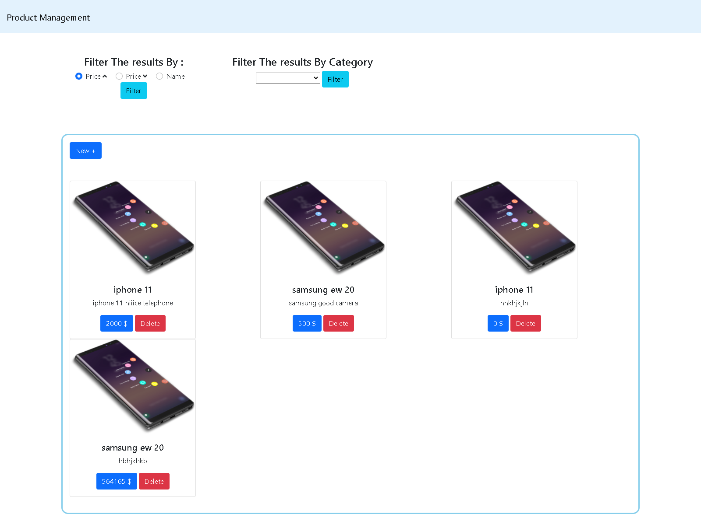
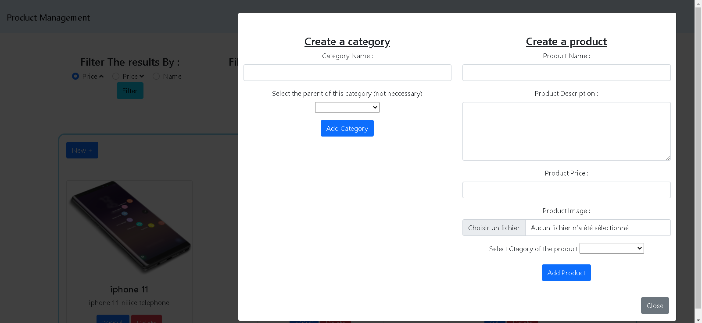

<html>
<head>
<meta charset="UTF-8">
<meta name="viewport" content="width=device-width, initial-scale=1.0">
<title>Document</title>
<link href="https://cdn.jsdelivr.net/npm/bootstrap@5.0.0-beta1/dist/css/bootstrap.min.css" rel="stylesheet" integrity="sha384-giJF6kkoqNQ00vy+HMDP7azOuL0xtbfIcaT9wjKHr8RbDVddVHyTfAAsrekwKmP1" crossorigin="anonymous">

<link rel="stylesheet" href="https://cdnjs.cloudflare.com/ajax/libs/font-awesome/5.15.1/css/all.min.css" integrity="sha512-+4zCK9k+qNFUR5X+cKL9EIR+ZOhtIloNl9GIKS57V1MyNsYpYcUrUeQc9vNfzsWfV28IaLL3i96P9sdNyeRssA==" crossorigin="anonymous" />

    
</head>
<body>
    

        
<h4>Coding Challenge Software Engineer application by Mohammed Amine Yassine</h4>
        

        

            

                

                    I represent to you a simple Web Application service responsible of manipulating Products and Categories
                
 
                
                    This Application is allow you to : 
                
                <ul>
                    <li>create and delete a category from the command line</li>
                    <li>create and delete a product from the command line</li>
                    <li>create and delete a product from the web app </li>
                    <li>create a category from the web app </li>
                    <li> Filter Product : sort by name, by price or filter by a category </li>
                </ul>
            

            

                
            

       

         
<i class="fas fa-circle"></i> The web application : 
 
I create a simple laravel web application to creation Product and delete them also , filtering them by price or name or category

 <i class="fas fa-circle"></i> Follow this steps so u can use the application : 
 
first before all you need to run the command 'php artisan migrate' to setup and database in your server , after that , you need to run the command 'php artisan serve' and click on the link  : 

                

                    
                

                

                    <h5>This is the homepage : </h5>
                    
Here you can browse all the product and filter them either by name , price or category

                
 

                    <h5>
                        Clicking on <button class="btn btn-primary">new +</button>  Button  : 
                    </h5>
                    
Here you can Create , Delete both Product and Categories

                

                

                    
                
 

<i class="fas fa-circle"></i> The web application : 

I create a simple laravel console application to creation and delete both products and categories 

<i class="fas fa-circle"></i> Follow this steps so u can use the application : 

 If you want to manage the categories , you need to run the command <h3>php artisan categories</h3> to display the categories menu  
 
 If you want to manage the products , you need to run the command <h3>php artisan products</h3> to display the products menu  
 
 
<h6>Any Questions ? , please do not hesitate to Contact us in : aminemohammedyassine@gmail.com
        </h6>

    

</body></html>